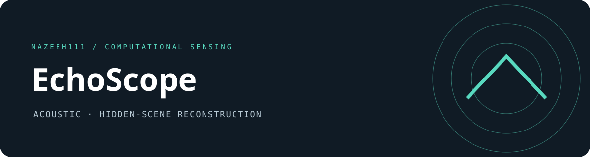

# EchoScope

This repository packages [AcousticNLOS](https://github.com/computational-imaging/AcousticNLOS/tree/babd679b74240e8dd10fd48b3b3aa61590513c76), by **David B. Lindell, Gordon Wetzstein and Vladlen Koltun**, for the CVPR 2019 acoustic non-line-of-sight imaging method. EchoScope adds command-line dispatch repair, regression checks, documentation and repository presentation. The original methods, datasets and reported research results belong to the cited source. [Source and additions](NOTICE.md).



Reconstruct hidden scenes from frequency-swept acoustic measurements. The workflow includes microphone calibration, demodulation, initial volume reconstruction, point-spread-function fitting, and iterative refinement.

## Run

Use Python with the versions recorded in `requirements.txt` for the original environment. These are legacy pins; installation on current Python may require an older isolated interpreter. Numerical source and its defaults are preserved.

Download the [measurement dataset](https://drive.google.com/a/stanford.edu/file/d/1pnRiD3e4EQiu-akvHkCMOyghwbVtQuvt/view?usp=sharing) separately and place it in `data/`. Dataset availability has not been verified in this publication.

```sh
python3 AcousticNLOSReconstruction.py letter_H
python3 AcousticNLOSReconstruction.py psf
python3 FitGaussianPSF.py
python3 ADMMReconstruction.py letter_H
```

The point-spread-function fit must precede iterative reconstruction. Other scene names are listed by the reconstruction script. Use `python3 AcousticNLOSReconstruction.py all` to dispatch all nine supported scenes in the existing order. A command-line variable-name error was fixed; the per-scene numerical implementation is unchanged.

## Inputs and outputs

Microphone calibration tables are included. Raw measurement captures are external. Initial volume arrays feed the fitted deconvolution and iterative pipeline; plotting and saved arrays retain their existing names, shapes, and conventions. The defaults use a 48 kHz sample rate, 2–20 kHz chirp, and 16 transmit/receive channels.

## Verification

See [verification](VERIFICATION.md) for exact local checks and limits. Small synthetic kernels establish numerical consistency, not captured-scene replication. `util/lct.py` includes an unused standalone `lct` helper with an inherited argument mismatch; the main reconstruction uses `run_lct` instead.

Maintained by **nazeeh111**. Separate bundled component notices remain in [THIRD_PARTY_NOTICES.md](THIRD_PARTY_NOTICES.md).
